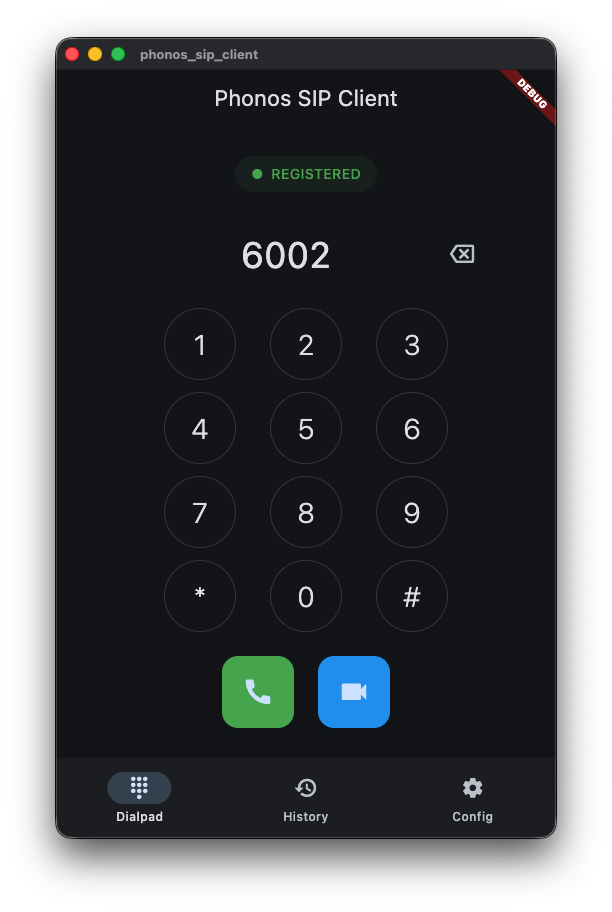
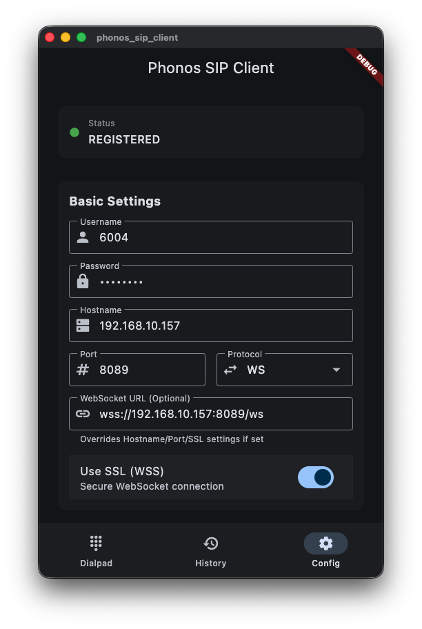

# Phonos SIP Client

A beautiful, open-source desktop SIP client built with Flutter for Windows, macOS, and Linux.

## Screenshots

  
  

## Features

*   **Cross-Platform:** Windows (x64), macOS (Universal), Linux (x64).
*   **SIP & WebRTC:** Supports WebSocket (WS/WSS), TCP, and SRTP voice/video calls.
*   **Video Calls:** Integrated video call support with Picture-in-Picture.
*   **Modern UI:** Clean Material Design 3 interface.
*   **Codecs:** Configurable preferred codecs (Opus, G722, PCMA, PCMU).

## Motivation

I couldn't find a good SIP desktop client app.

## Getting Started

1.  **Clone:** `git clone <repo>`
2.  **Install:** `flutter pub get`
3.  **Run:** `flutter run -d macos` (or windows/linux)

## License

GNU GPLv3 License.
